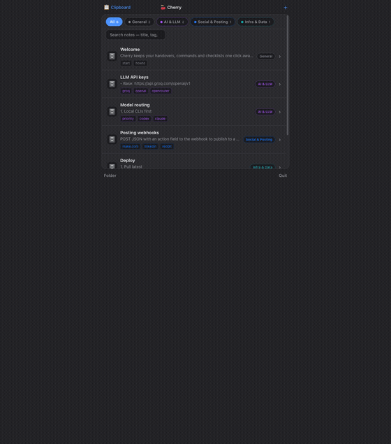
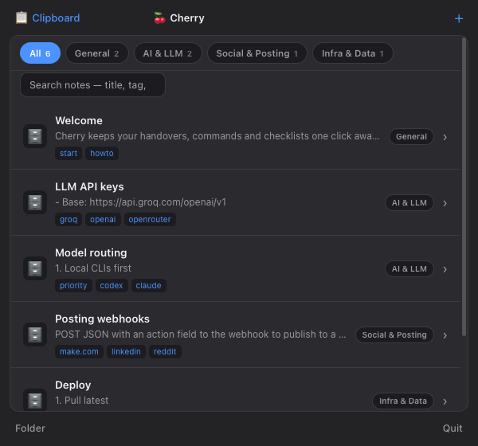
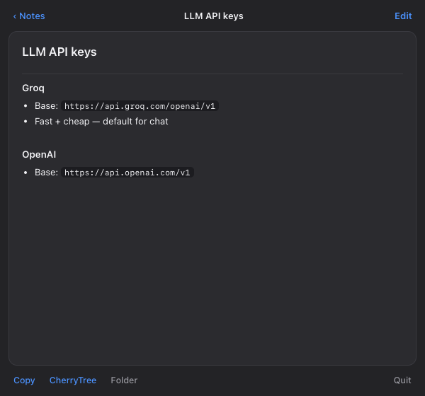
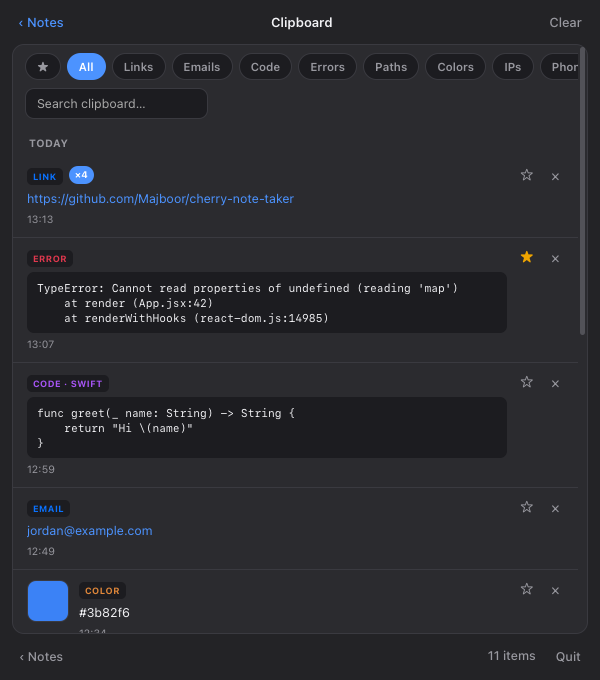
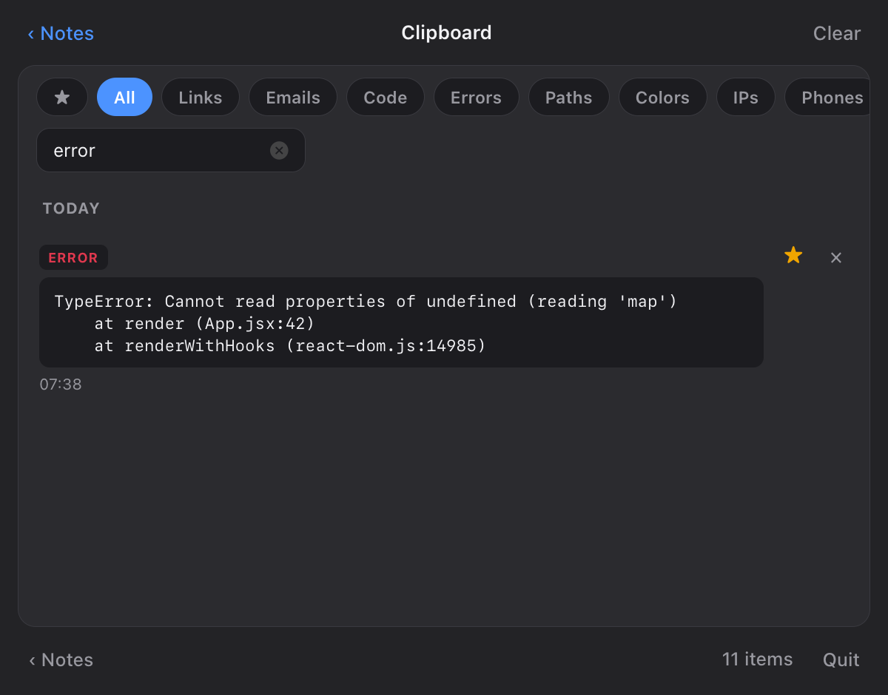
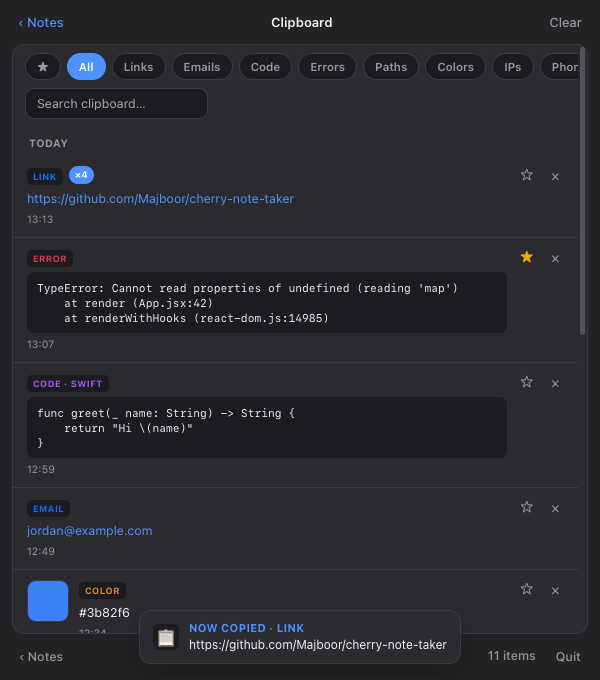

<div align="center">

# 🍒 Cherry Note Taker

**A super-light macOS menu-bar notes app — with a built-in smart clipboard manager.**

Markdown notes, Spotlight launchers, CherryTree export, and a clipboard history that
auto-sorts everything you copy — in ~300 lines of dependency-free Swift.


<br>



</div>

---

## ✨ What it does

- 🗂️ **Menu-bar notes** — an **All Notes** list; open any note to read rendered Markdown.
- ✍️ **Add / edit / delete in-app** — write Markdown, hit **Save**, it's a plain `.md` file.
- 🔎 **Spotlight launchers** — every note gets its own app; ⌘-Space → type its name → jump straight to it.
- 📋 **Clipboard history** — everything you copy, auto-sorted by **type** and **date**, with search & favourites.
- 🌳 **CherryTree export** & one-click **Copy** — grab a whole note (or prompt) instantly.
- 🪶 **No lock-in, no dependencies** — notes are just files in a folder you choose; pure AppKit + WebKit.

<br>

<div align="center">
<table>
  <tr>
    <td align="center"><br><sub><b>All Notes</b></sub></td>
    <td align="center"><br><sub><b>Read a note</b></sub></td>
    <td align="center"><br><sub><b>Clipboard history</b></sub></td>
  </tr>
</table>
</div>

---

## 📋 The clipboard manager

Everything you copy is captured into a local history and **auto-classified** — no tagging, no setup.

<div align="center">
<table>
  <tr>
    <td align="center"><br><sub><b>Search + filter chips</b></sub></td>
    <td align="center"><br><sub><b>Click to copy back · in-app toast</b></sub></td>
  </tr>
</table>
</div>

| | |
|---|---|
| 🔗 **Links** · ✉️ **Emails** · 📞 **Phones** | detected from plain strings |
| 🎨 **Colors** (with a live swatch) · 🌐 **IPs** | `#3b82f6`, `192.168.1.24`, … |
| 💻 **Code** — *auto-labeled by language* | swift · python · js · bash · json · sql · html · … |
| 🐞 **Errors & stack traces** | `TypeError:`, `file.js:42`, tracebacks → their own category |
| 📁 **Paths** · 🖼️ **Images** · 🎞️ **Videos** · 📄 **Files** | thumbnails for images; name + path for files |

Plus:
- 🔁 **Copy the same thing twice?** It doesn't duplicate — the card shows a **×2 / ×3** counter and jumps to the top.
- 🔍 **Search** across preview text, filename, path, language and type.
- ⭐ **Favourites** — star the clips you reuse; they're kept even past the history cap.
- 🔒 **Privacy-aware** — password-manager clips (concealed/transient) are **ignored**; history is capped and local
  (`~/Library/Application Support/NASNotes/clips`). **Clear** anytime.

---

## 🚀 Install

Requirements: macOS 11+, Xcode command-line tools (`swiftc`). CherryTree optional (`brew install cherrytree`).

```bash
git clone https://github.com/Majboor/cherry-note-taker.git
cd cherry-note-taker
./Scripts/build.sh                # compiles + installs "~/Applications/Cherry.app"
./Scripts/install-login-item.sh   # (optional) start at login
```

Look for the **note icon** in your menu bar. `build.sh` seeds a sample note if your notes folder is empty.

---

## 🎯 Usage

| Action | How |
|--------|-----|
| Browse notes | Click the menu-bar item → **All Notes** |
| New note | **+** (top-right) |
| Edit / delete | Open a note → **Edit** → **Save** / **Delete note** |
| Copy a note | Note view → **Copy** |
| Open in CherryTree | Note view → **CherryTree** |
| Open the clipboard | **📋 Clipboard** (top-left of All Notes) |
| Copy an item back | Click it (a toast confirms) |
| Jump to a note from anywhere | ⌘-Space → type `"<Note> Handover"` |

Adding/removing notes auto-runs `Scripts/rebuild.sh` to refresh the CherryTree doc and Spotlight launchers.

---

## 🗄️ Notes store

Notes are `.md` files in the directory set by `NAS_NOTES_DIR` (default `~/.rpidrive/notes`). The first
`# Heading` line becomes the note's title. Back them up, grep them, or sync them however you like.

Adding notes programmatically (e.g. from a script or an AI agent) is just writing a `.md` file —
see **[docs/ADDING-NOTES.md](docs/ADDING-NOTES.md)** for the full handover.

## 🧱 Project layout

```
Sources/main.swift        # menu-bar app, popover, file I/O, nasnote:// URL scheme, bridge
Sources/html.swift        # the UI (HTML/CSS/JS) + Markdown renderer, as one inline template
Sources/clipboard.swift   # pasteboard watcher, classifier, on-disk clip store
Scripts/build.sh          # compile + bundle + install the .app
Scripts/install-login-item.sh
Scripts/make-launchers.sh # build/prune the per-note Spotlight apps
Scripts/rebuild.sh        # regenerate CherryTree doc + launchers
```

## 🗺️ Roadmap

See [ROADMAP.md](ROADMAP.md) — standalone editor window, note search, git-backed sync, global hotkey.
Work happens on `feature/*` branches. Changes are logged in [CHANGELOG.md](CHANGELOG.md).

## 📄 License

MIT — see [LICENSE](LICENSE).
